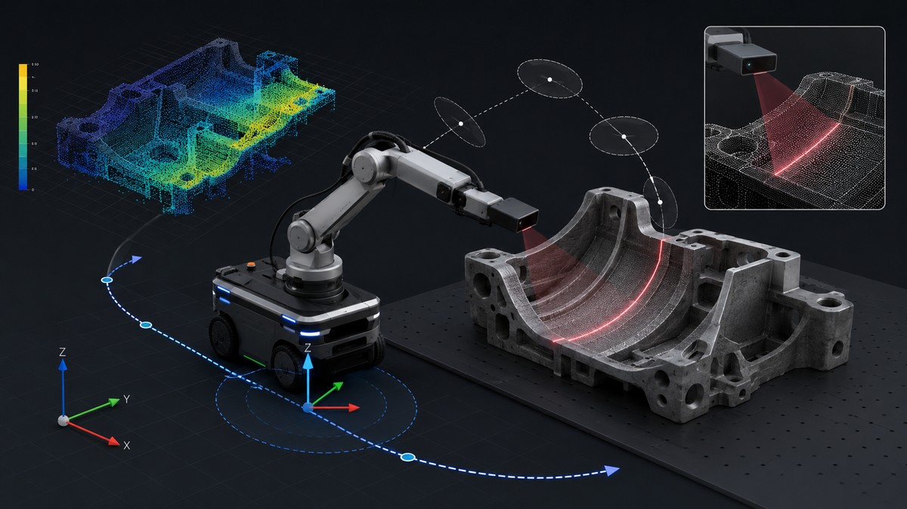

# Muhammed Elyamani

PhD Researcher in Robotics and Control focusing on structure-aware planning, state estimation, and active sensing for mobile manipulation.

  

> Conceptual research banner illustrating my current PhD direction. It is a visual summary, not an experimental result.

## Research Identity

I am building a research portfolio around robotics and control, with emphasis on:

- mobile manipulation,
- motion planning,
- active sensing,
- state estimation,
- visual and spectral scanning,
- ROS2 / MoveIt2 / GTSAM-based robotics workflows.

## Current Research Direction

My current PhD direction studies structure-aware active scanning for mobile manipulators.

The goal is to plan robot motion that improves information acquisition, not only task completion. The robot must satisfy geometric, sensing, kinematic, collision, and uncertainty constraints during scanning and inspection tasks.

Key elements include:

- line-scan / one-row RGB sensing as a proxy for hyperspectral pushbroom acquisition,
- surface coverage and scan-quality metrics,
- camera visibility and viewing-angle constraints,
- mobile base and manipulator coordination,
- state estimation and uncertainty-aware planning,
- reproducible simulation, experiment logging, and paper-oriented research artifacts.

## Main Public Research Repositories

| Repository | Role |
|---|---|
| `line-scan-mobile-manipulator-demo` | Public scaffold for line-scan-aware active scanning and coverage planning |
| `ros2-moveit-grasping-demo` | ROS2 / MoveIt2 manipulation demo |
| `GTSAM_SLAM_VISION` | Visual pose estimation and factor-graph/state-estimation experiments |
| `robotics-control-learning-labs` | Control foundations and reproducible learning labs |
| `ros2-mobile-robotics-labs` | ROS2 mobile robotics learning/demo repository |
| `research-reading-map` | Public reading map and paper-note templates |

## Public / Private Research Boundary

Public repositories are used for sanitized portfolio evidence, simplified demos, reproducible learning labs, public reading maps, and non-confidential research scaffolds.

Unpublished research algorithms, paper drafts, detailed gap analysis, advisor feedback, real lab data, ablation studies, and paper-specific implementations remain private until they are ready for publication or approved release.

## Technical Stack

- **Robotics:** ROS2, MoveIt2, Gazebo, RViz
- **Control:** MATLAB, Simulink, state-space control, LQR, observers
- **State estimation:** GTSAM, factor graphs, visual pose estimation, SLAM
- **Perception:** RGB, line-scan-inspired sensing, hyperspectral imaging concepts, computer vision
- **Programming:** Python, C++, MATLAB
- **Research tools:** LaTeX, Git, experiment logs, paper reading maps

## Current Goal

Convert learning and implementation work into visible research artifacts:

- clean repositories,
- runnable demos,
- experiment logs,
- plots and figures,
- technical reports,
- paper submissions.
